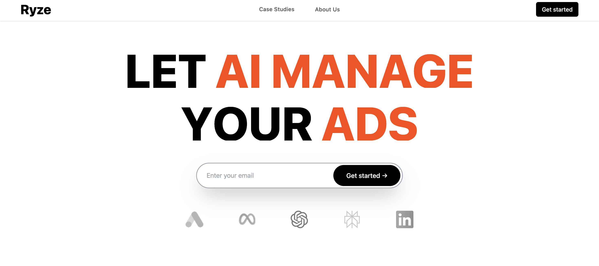
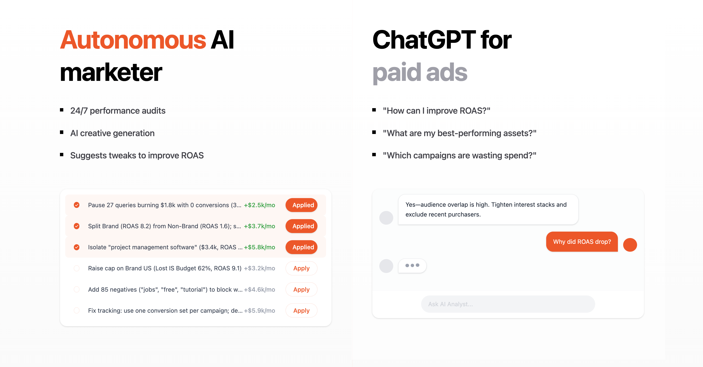
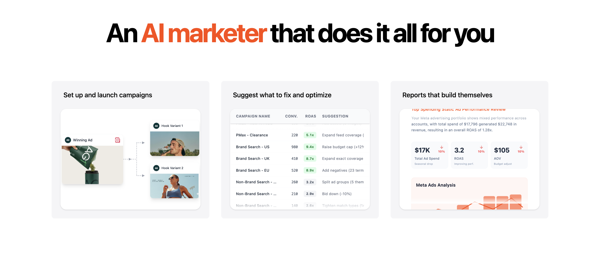

# get-ryze

Live demo: https://get-ryze.vercel.app/

## Project Overview

`get-ryze` is a marketing / growth microsite template focused on showcasing AI-driven marketing features, case studies, and product benefits. This fork preserves the original project's core functionality while significantly enhancing the visual design and micro-interactions to produce a more polished, modern user experience. The result is a site that's faster to skim, more delightful to interact with, and better at converting visitors into leads.

## NEW FEATURES AS COMPARED TO ORIGINAL

We kept the core features of the original project intact while enhancing the overall visual and interaction experience with polished animations and micro-interactions. These additions make the site feel more aesthetic, elegant, and modern.

Highlights:

- Hero flip text: the hero section headline cycles through value propositions with a smooth flip/rotate animation, immediately communicating product benefits.
- Image cursor trail: subtle image-following thumbnails appear and fade as the cursor moves, adding a tactile, product-focused layer to visual storytelling.
- Animated buttons: CTAs animate on hover and focus with a tasteful flip/scale effect, improving perceived responsiveness and encouraging clicks.
- Case studies animations: card-entry, hover lift, and coordinated image reveals emphasize outcomes and make case studies feel interactive.
- Site-wide coordinated transitions: sections animate in and out in a framer-like manner to create a consistent rhythm across the entire site.

Result: these visual upgrades keep the original UX intact while elevating the brand presence and clarity of message—visitors notice the polish, and the site feels more premium.

---

## Demo screenshots

Below are a few representative screenshots from the project demonstrating the hero, features, and case study atmospheres.








---

## In-depth Feature

- Hero flip text (`FlipText`): Quickly communicates multiple benefits in the same headline real-estate. The flip animation draws the eye to changing phrases without requiring extra clicks or space — higher chance the visitor reads multiple value props.

- Image cursor trail (`ImageCursorTrail`): Adds delight and a sense of direct manipulation. When visitors move their cursor over image showcases, the trailing previews create a feeling of depth and exploration that increases engagement time.

- Animated Buttons (`Button`, `TextHover`): Micro-interactions communicate polish and performance. Well-timed hover flips and subtle scaling make CTAs feel trustworthy and clickable, improving conversion micro-metrics.

- Features Showcase & Marketer Tools: Each feature card (AccountAudits, BudgetReallocation, CreativeAnalysis, CreativeGeneration, KeywordOptimization) is written to emphasize measurable outcomes (time-saved, ROI uplift, creative throughput). Animations and staggered reveals guide attention to the most important metrics.

- Case Studies & Insights: Animated reveals, hover previews, and image transitions make evidence-based storytelling more compelling. Instead of static grids, visitors experience the case studies as curated narratives.

- Testimonials & Client Marquee: Animated logo strips and testimonial cards build social proof while remaining lightweight and accessible across breakpoints.

---

## Main Features (concise)

- Hero section with animated flip text (`FlipText`).
- Interactive image cursor trail for a tactile image showcase (`ImageCursorTrail`).
- Animated call-to-action buttons and micro-interactions (`Button`, `TextHover`).
- Feature showcase sections and marketer tools.
- Case studies grid and hero with animated previews.
- AI showcase pages/components highlighting AI-driven workflows.
- Client marquee / testimonial components and footer utilities.

## Full Feature List (detailed)

- Responsive layout and header navigation (`Header`).
- Hero flip/rotating headline animation (`FlipText.jsx`).
- Image cursor trail effects (`ImageCursorTrail.jsx`).
- Reusable UI primitives: `Button`, `EmailInput`, `TextHover`.
- Features: `AccountAudits`, `BudgetReallocation`, `CreativeAnalysis`, `CreativeGeneration`, `KeywordOptimization`.
- Features showcase and marketer panel with campaign cards and suggestions.
- Case studies pages: `CaseStudiesGrid`, `CaseStudiesHero`, insights section with animated cards.
- AI-focused sections: `AutonomousAI`, `ChatGPTAds`.
- Testimonials components with multiple card layouts.
- Client marquee and logo strips for brand trust.
- Footer with responsive layout and utility links.
- Global styles and animations in `index.css`, `animations.css`, and `marquee.css`.

## Tech Stack

- Vite (React)
- React + JSX
- Tailwind CSS for utility styling
- Framer Motion
- Small JS helpers and CSS for framer-like coordinated transitions

## Getting Started (How to run)

Prerequisites:

- Node.js (LTS recommended)
- npm or yarn

Clone and run locally:

```bash
git clone https://github.com/Aditya-KumarJha/get-ryze.git
```
```bash
cd get-ryze
```
```bash
npm install
```
```bash
npm run dev
```

Build for production:

```bash
npm run build
```
```bash
npm run preview
```

Deployment:

- The site is deployed on Vercel at the Live demo link above. Deploy to Vercel for automatic previews and simple CI.

## Where the animations live (file pointers)

- Hero flip text: src/components/ui/FlipText.jsx and src/sections/HeroSection.jsx
- Image cursor trail: src/components/ui/ImageCursorTrail.jsx
- Buttons and small interactions: src/components/ui/Button.jsx, src/components/ui/TextHover.jsx
- Case studies: src/sections/CaseStudies/ components


## Per-page Detailed Features

This section walks through each page and the major components that power it, with notes on behavior, animations, and implementation hints.

- Home (`src/pages/HomePage.jsx`)
	- `HeroSection` (`src/components/sections/HeroSection.jsx`): Animated headline using `FlipText.jsx` with staggered entrance, subtitle fade, and CTA buttons that animate on hover. Includes an optional background image/video and accessibility-friendly controls for motion preferences.
	- `HowItWorks` (`src/components/sections/HowItWorks.jsx`): Step-by-step feature cards with reveal-on-scroll animation and icon micro-interactions.
	- `FeaturesShowcase` (`src/components/sections/FeaturesShowcase.jsx`): Grid/list of feature cards (uses `AccountAudits`, `BudgetReallocation`, `CreativeAnalysis`, `CreativeGeneration`, `KeywordOptimization`) with hover lifts, staggered entrance, and inline metrics.
	- `ClientMarquee` (`src/components/sections/ClientMarquee.jsx`): Continuous logo carousel with reduced-motion fallback and clickable logos linking to case studies or client pages.
	- `Testimonials` (`src/components/sections/Testimonials/index.jsx`): Multiple testimonial card types with slide/up animations and automatic carousel controls.
	- `AIShowcase` (`src/components/sections/AIShowcase/index.jsx`): Interactive demos and feature highlights (`AutonomousAI.jsx`, `ChatGPTAds.jsx`) with animated code / result previews and copy-to-clipboard affordances.
	- `TickerSection` (`src/components/sections/TickerSection`): Small lead-capture form (`HeroAuditForm.jsx`) and ticker component (`Ticker.jsx`) with input validation and subtle entry animations.
	- `MarketerSection` (`src/components/sections/MarketerSection/index.jsx`): Campaign cards and suggestions list with animated progress bars and interactive filters (`ReportsPanel`, `SuggestionsList`).

- Case Studies (`src/pages/CaseStudies.jsx`)
	- `CaseStudiesHero` (`src/components/sections/CaseStudies/CaseStudiesHero.jsx`): Full-bleed hero with animated headline, background parallax, and quick filters.
	- `CaseStudiesGrid` (`src/components/sections/CaseStudies/CaseStudiesGrid.jsx`): Masonry/grid layout with image reveals, hover previews, and a focus state that opens a detailed panel.
	- `InsightsSection` (`src/components/sections/CaseStudies/InsightsSection/InsightsSection.jsx`): Insight cards (`InsightCard.jsx`) that animate into view with metrics-first UI and CTA links to downloadable PDFs or detailed writeups.

- About (`src/pages/About.jsx`)
	- `OurStory` (`src/components/sections/About/OurStory.jsx`): Timeline-style entries with alternating content and entry animations that guide reading order.
	- `AboutHero` (`src/components/sections/About/AboutHero.jsx`): Subtle animated headline and brand statement with touch-friendly interactions.
	- `AboutExperience`, `AboutJourney`, `AboutAutomation`, `AboutConclusion`: Each section includes image/text pairings with staggered reveals, counters, and small animated charts where applicable.
	- `AboutGallery` (`src/components/sections/About/AboutGallery.jsx`): Responsive gallery with lightbox preview and cursor-aware hover effects.

- Shared UI & Utilities
	- `FlipText.jsx` (`src/components/ui/FlipText.jsx`): Reusable component for rotating headline phrases — supports timing, easing, and reduced-motion options.
	- `ImageCursorTrail.jsx` (`src/components/ui/ImageCursorTrail.jsx`): Tracks cursor/touch movement and renders a small image trail; configurable for fade, scale, and throttling to conserve CPU.
	- `Button.jsx`, `TextHover.jsx`: Reusable button and hover primitives with accessible focus styles, keyboard support, and animated states.
	- `EmailInput.jsx`: Input component with validation microcopy and submit feedback animations.
	- Global styles: `index.css`, `styles/animations.css`, `styles/marquee.css` with utility classes and motion tokens.

## Implementation Notes (quick developer guide)

- Motion & performance: animations are implemented with CSS transitions and lightweight JS for coordination. Where heavy transforms are used, the code prefers `transform` and `opacity` to avoid layout thrashing.
- Accessibility: components check `prefers-reduced-motion` and gracefully reduce or disable non-essential animations. All interactive controls have keyboard focus states and ARIA labels where applicable.
- The project is structured for clarity: sections under `src/components/sections/` contain page-specific components; shared UI primitives live under `src/components/ui/`.

## Contributing

- Feel free to open issues or pull requests against this repository. Pull requests should include a short description of changes and, where applicable, demo screenshots or short GIFs showing the animation. For animation or motion changes, include a short note about performance and accessibility trade-offs.
